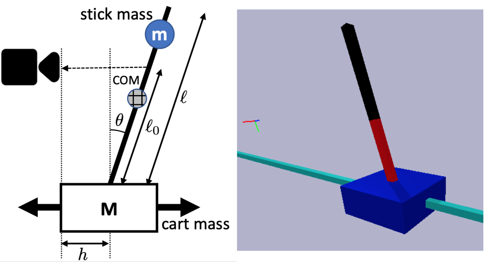

# How Are Learned Perception-Based Controllers Impacted by the Limits of Robust Control?

[Jingxi Xu](https://jxu.ai),
[Bruce Lee](https://brucedlee.github.io/),
[Dinesh Jayaraman](https://www.seas.upenn.edu/~dineshj/),
[Nikolai Matni](https://nikolaimatni.github.io/),
<br>
Columbia University, New York, NY, United States<br>
University of Pennsylvania, Philadelphia, PA, United States<br>
[L4DC 2021](https://l4dc.ethz.ch/)

### [Project Page](https://jxu.ai/rl-vs-control-web/) | [Arxiv](https://arxiv.org/abs/2011.02608)



## Setup

TBD

## Citation

```
@inproceedings{xu2021rlvscontrol,
	title={How Are Learned Perception-Based Controllers Impacted by the Limits of Robust Control?},
	author={Xu, Jingxi and Lee, Bruce and Matni, Nikolai and Jayaraman, Dinesh},
	booktitle={Learning for Dynamics and Control (L4DC)},
	year={2021}
}
```
